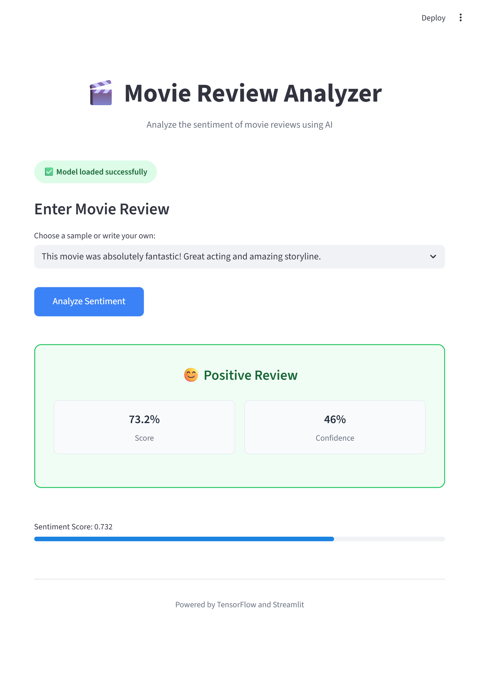

# IMDB Review Sentiment Analyzer with SimpleRNN

## Project Overview
This project focuses on developing a sentiment analysis model for movie reviews sourced from the IMDB dataset. The core of the solution is a Deep Learning model built using a Simple Recurrent Neural Network (SimpleRNN), implemented with TensorFlow/Keras. The model is designed to classify movie reviews as either positive or negative, demonstrating the application of recurrent neural networks in natural language processing tasks.

## System UI


## Features
- **IMDB Dataset Integration**: Seamless loading and preprocessing of the IMDB movie review dataset.
- **Text Preprocessing**: Includes tokenization, padding, and vocabulary creation to prepare text data for the neural network.
- **SimpleRNN Model**: A robust Simple Recurrent Neural Network architecture designed for sequential data processing.
- **Binary Sentiment Classification**: Classifies reviews into two categories: positive or negative.
- **Training & Evaluation**: Comprehensive training script with evaluation metrics to assess model performance.
- **Customizable Parameters**: Easy-to-modify parameters for experimentation with different model configurations.

## Getting Started

### Prerequisites
Before you begin, ensure you have met the following requirements:
- Python 3.8+
- TensorFlow 2.x
- Keras (usually bundled with TensorFlow)
- NumPy
- Matplotlib (for visualization, if applicable)

### Installation

To get a local copy up and running, follow these simple steps.

1. Clone the repository:
   ```bash
   git clone https://github.com/KodewithArun/IMDB-Review-Sentiment-Analyzer-with-SimpleRNN.git
   cd IMDB-Review-Sentiment-Analyzer-with-SimpleRNN
   ```
2. Install the required Python packages:
   ```bash
   pip install -r requirements.txt
   ```
3. Run the training script:
   ```bash  
   streamlit run app.py
   ```

## Thanks You